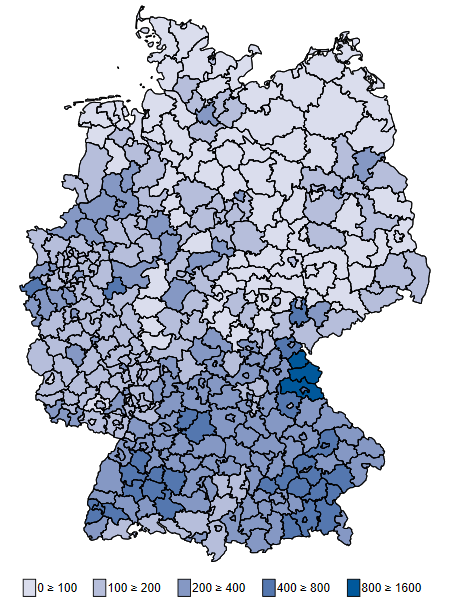
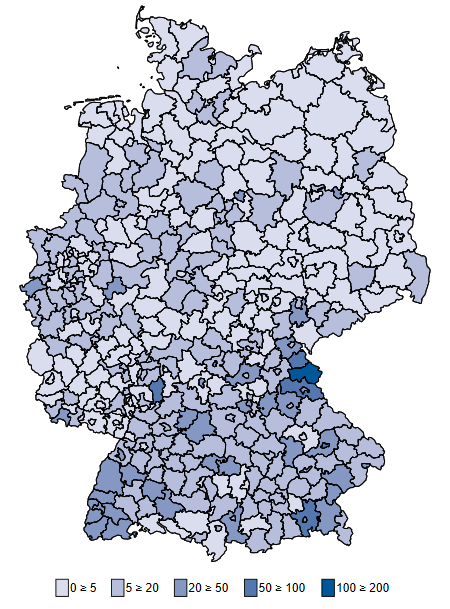

# Info

Hier sollen aktuelle Informationen zur Ausbruchsentwicklung der Covid-19 Pandemie in Deutschland für den internen Austausch gesammelt werden. 

# Regionale Ungleichheiten {.tabset}

## Regionale Fallzahlen 

Regionale Fallzahlen       |  Regionale Todeszahlen
:-------------------------:|:-------------------------:
  |  

Die regionalen Fallzahlen sind weitherhin stark durch das Ausbruchsgeschehen getrieben. Die höchsten Fallzahlen finden wir in den Landkreisen und kreisfreien Städten in denen es bereits sehr früh zu vielen Ansteckungen gekommen ist (Landkreise Heinzberg, Hohenlohe und Tirschenreuth). In der Mehrheit der Kreise sind die Fallzahlen pro Einwohner gering. 

Stand 20. April 2020

## Regionale Fallzahlen (pro 100k Einwohner)

Regionale Fallzahlen pro 100k Einwohner       |  Regionale Todeszahlen pro 100k Einwohner
:-------------------------:|:-------------------------:
  |  

Stand 20. April 2020

# Informationen über das regionale Ausbruchsgeschehen {.tabset}

Hier sollten Informationen zum Verlauf des regionalen Ausbruchsgeschehens gesammelt werden

## Baden Württemberg 

### Bad Rappenau

17.April 2020 
[Ende der Quarantäne im Alpenland Altenheim](https://www.rnz.de/nachrichten/sinsheim_artikel,-bad-rappenau-quarantaene-im-alpenland-altenheim-nach-sechs-wochen-aufgehoben-update-_arid,502459.html)

## Schleswig-Holstein

### Nordfriesland

27. April 2020
[Grillparty in Nordfriesland](https://www.spiegel.de/panorama/nordfriesland-neue-corona-faelle-nach-illegaler-grillparty-a-e40f8468-ec97-40f3-9d8a-2d954abe320e)

# Linksammlungen {.tabset}

## Regionales Monitoring des Ausbruchsgeschehens

[Covid-19 Small Area Monitor von der Uni Bielefeld und Uni Heidelberg] (http://covidmonitor.de/)

# About this page

BAM!

