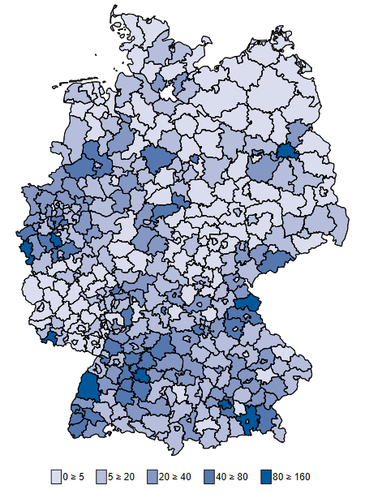

# Intro 

Hier sollen aktuelle Informationen zur Ausbruchsentwicklung der Covid-19 Pandemie in Deutschland für den internen Austausch gesammelt werden. 

## News

## Regionale Ungleichheiten {.tabset}

### Regionale Fallzahlen 

Regionale Fallzahlen       |  Regionale Todeszahlen
:-------------------------:|:-------------------------:
  |  

Die regionalen Fallzahlen sind weitherhin stark durch das Ausbruchsgeschehen getrieben. Die höchsten Fallzahlen finden wir in den Landkreisen und kreisfreien Städten in denen es bereits sehr früh zu vielen Ansteckungen gekommen ist (Landkreise Heinzberg, Hohenlohe und Tirschenreuth). In der Mehrheit der Kreise sind die Fallzahlen pro Einwohner gering. 

Stand 20. April 2020

### Regionale Fallzahlen (pro 100k Einwohner)

Regionale Fallzahlen pro 100k Einwohner       |  Regionale Todeszahlen pro 100k Einwohner
:-------------------------:|:-------------------------:
  |  

Stand 20. April 2020

## About this page

<<<<<<< HEAD

=======
>>>>>>> 1f237e6b27730fd00767cfd8e2db8a8fcb2a5ae5
BAM!

